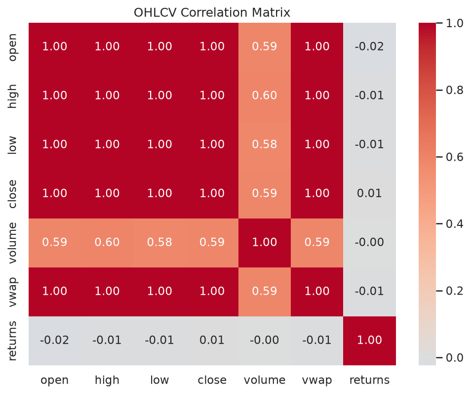
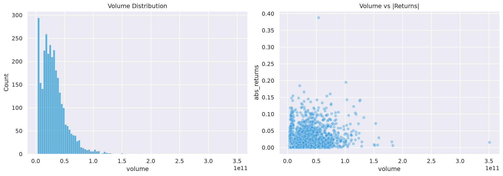
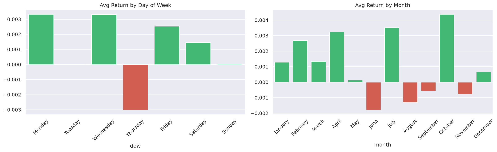
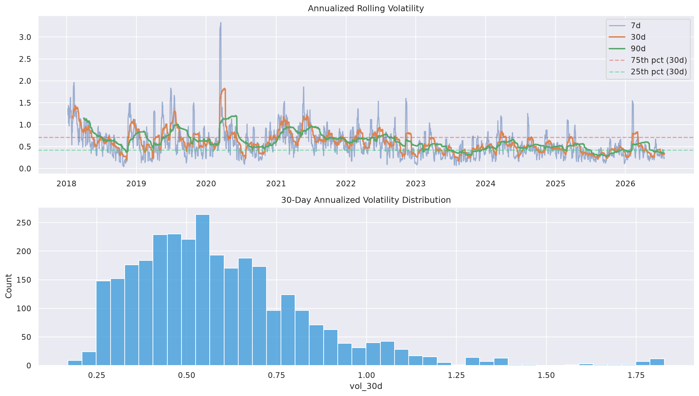
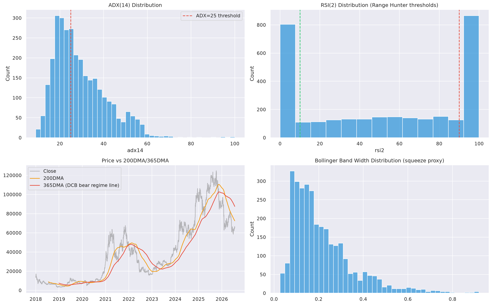
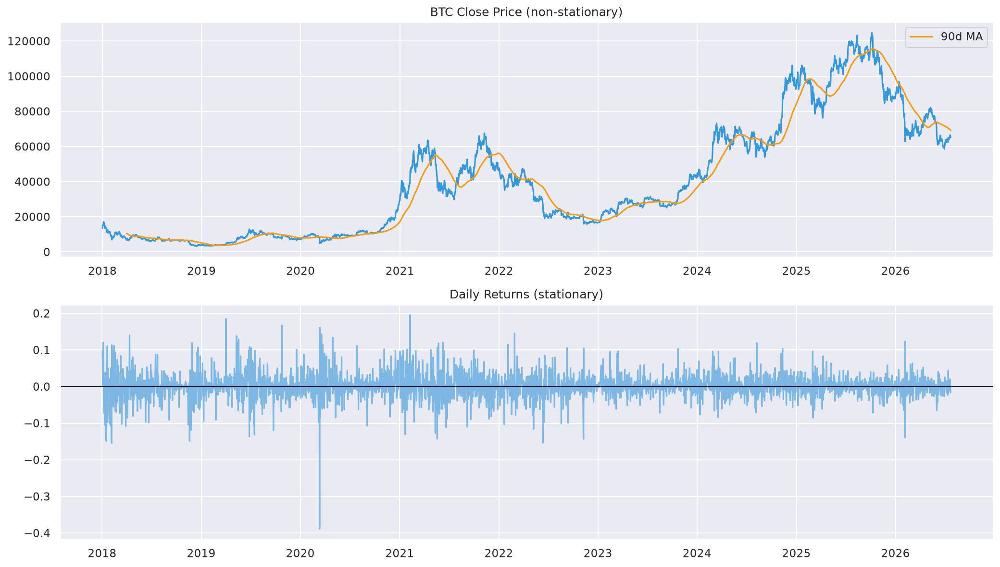
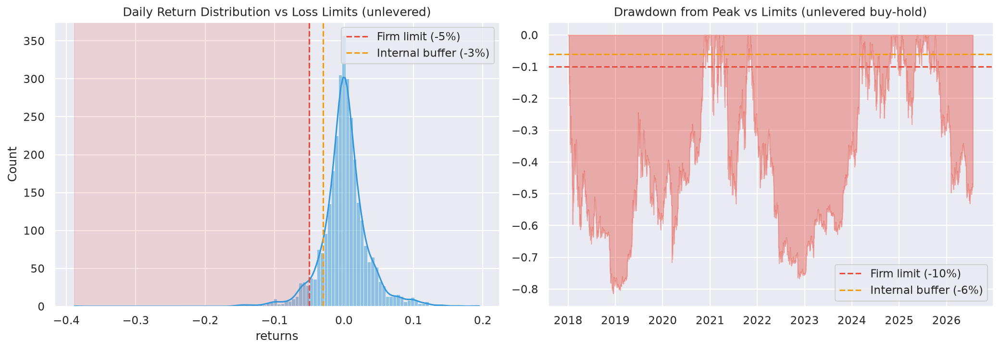

# Exploratory Data Analysis: btc_prop_strategy_v2

**Date:** 2026-07-23
**Data Range:** 2018-01-01 to 2026-07-23 (daily bars)
**Total Rows:** 3,126
**Project Type:** hybrid

**Data scope caveat:** Only BTC/USD daily OHLCV was reachable this session (via FMP). Funding/OI, spot+futures CVD, on-chain valuation (MVRV Z, SOPR, Puell, RHODL), Coinglass microstructure (liquidation heatmap, net delta, large orders), and ETF flows all remain unsourced — this EDA covers price/volume/technical structure only. Funding-rate, CVD, on-chain, and Coinglass-layer EDA is deferred until those sources are found (tracked as open questions in DISCOVERY.md/RESEARCH.md).

---

## Data Overview

| Metric | Value |
|--------|-------|
| Rows | 3,126 |
| Columns | date, open, high, low, close, volume, vwap, returns, log_returns |
| Date Range | 2018-01-01 to 2026-07-23 |
| Missing Values | 1 (first-row return, expected) |
| Duplicate Timestamps | 0 |
| Data Gaps (>1 day) | 0 (BTC trades daily, no gaps) |

Clean dataset — no gaps, no duplicates, no material missingness. Good foundation for backtesting once the missing data sources (funding/on-chain/Coinglass) are resolved.

---

## Key Findings

### 1. Distribution Characteristics
- Mean daily return: +0.11%, Std: 3.41%
- **Skewness: -0.30** (mild left skew — slightly fatter left tail, consistent with crypto's sharp-crash-vs-grinding-rally asymmetry)
- **Kurtosis (excess): 8.67** (very heavy tails — extreme moves far more common than a normal distribution would predict)
- **Jarque-Bera: p ≈ 0** — returns are decisively non-normal
- **Stationarity:** price series is non-stationary (ADF p=0.63, KPSS p=0.01 → confirms non-stationary), returns series is stationary (ADF p≈0, KPSS p=0.10 → confirms stationary). This is the expected, correct result for a price series and validates using returns/indicators (not raw price) as model inputs.

### 2. Correlation Structure
OHLC are near-perfectly correlated with each other (expected, same underlying move). Volume shows weak correlation with price level and close-to-zero linear correlation with same-day returns — volume spikes don't linearly predict direction, consistent with using volume as a *confirmation* filter (per DISCOVERY.md's Range Hunter volume-spike confirmation) rather than a standalone directional signal.

### 3. Volume Insights
49 volume anomalies (>3 std above mean) across 3,126 days (~1.6% of days) — infrequent enough to be meaningful outlier events, not noise. Volume vs |returns| scatter shows the expected loose positive relationship (bigger moves tend toward higher volume) without being a clean linear predictor.

### 4. Seasonality
- **Best day of week:** Monday (+0.33% avg) / **Worst:** Thursday (-0.30% avg)
- **Best month:** October (+0.44% avg) / **Worst:** June (-0.18% avg)

These are directionally interesting but **not corroborated by DISCOVERY.md's source docs**, which claimed Tuesday/Wednesday as the best shorting days and specific *intraday* session windows (USA open 16:00-18:00 UTC, early Asia 00:00-02:00 UTC) — this EDA used daily bars and cannot test intraday session timing at all. The day-of-week finding here (Monday best, Thursday worst) actually **contradicts** the source docs' Tuesday/Wednesday claim. Recommend re-running this specific check on intraday data before trusting either version, and treating the source docs' session-timing claims as unvalidated until then.

### 5. Volatility Regimes
30-day annualized volatility: median 55.3%, ranging from 42.3% (25th pct) to 71.2% (75th pct) — BTC exhibits strong volatility clustering (visible in the rolling-vol plot), which is exactly the regime-dependency the confluence-scorer's macro/technical layers are meant to adapt to.

### 6. Indicator Analysis (Trend Rider / Range Hunter / DCB overlay inputs)
- **ADX(14) > 25** (trending regime): 55.7% of days — trend-following has ample opportunity, not a rare regime.
- **Trend Rider long trigger** (EMA9>EMA21 AND ADX>25): fires on 29.0% of days — active enough to avoid DISCOVERY.md's own kill-criterion concern about insufficient trade frequency.
- **RSI(2) extreme** (<10 or >90, Range Hunter trigger): fires on 55.5% of days — more frequent than expected; worth tightening in `/cbt:config` if this proves too noisy in backtest (Connors' original equities research implies rarer, higher-conviction extremes).
- **DCB-overlay "confirmed bear" condition** (price < 365DMA): true on 32.3% of history — a meaningfully common regime, not a rare edge case, so the DCB overlay (and its unvalidated accuracy claims flagged in RESEARCH.md) will see real, frequent use and deserves priority validation in `/cbt:build`.
- **Current regime (as of 2026-07-23):** price is **below** the 365DMA — bear regime is active right now, independently corroborating `crypto_algo_trading/DISCOVERY.md`'s characterization of May 2026 as "late-stage bear."

### 7. Stationarity
See distribution section above — confirmed price non-stationary / returns stationary, as expected.

---

## Prop Firm Risk Assessment

Config.yaml sets: firm daily loss limit 5% / internal buffer 3%, firm max drawdown 10% / internal buffer 6%, max leverage 3x.

### Daily Loss Risk (unlevered BTC buy-and-hold baseline)
- Probability of a raw BTC daily move exceeding the firm's -5% limit: **5.50%** of days
- Probability of exceeding the internal -3% buffer: **12.10%** of days
- Worst historical single-day return: **-38.81%**
- **At naive 3x notional leverage with no stop-loss**, the worst day becomes -116% — instant account termination, and even the median volatility regime would breach the internal buffer on ~30% of days.

### Drawdown Risk (unlevered buy-and-hold baseline)
- Probability of buy-and-hold drawdown exceeding the firm's -10% limit: **83.05%** (BTC's peak-to-trough drawdowns are large and common across cycles)
- Worst historical drawdown: **-81.38%** (2018 bear market)

### Critical Interpretation — Read Before Trusting These Numbers
The figures above assume **naive, undifferentiated 3x notional exposure to spot BTC returns held continuously** — that is NOT what this strategy does. Config.yaml's actual position-sizing rule risks a fixed **0.5% of account equity per trade**, sized by dividing that risk budget by the ATR-based stop distance — not by taking 3x notional directional exposure and holding through drawdowns. Because ATR-based stops widen automatically in high-volatility regimes (the 30d-vol range found above, 42%-71% annualized), the *effective* position size shrinks exactly when raw volatility (and this naive-leverage risk) rises. This EDA's naive-leverage numbers are the strongest evidence yet for **why** the strategy must use risk-based (not notional-leverage-based) position sizing — they are not a criticism of the design, they're a demonstration of why the design is necessary.

That said, this comparison could not be run properly: doing so requires simulating the actual strategy (entries, ATR-sized stops, confluence gating) against this price history, which is `/cbt:build` + `/cbt:run` work, not EDA. Treat the numbers above as a *raw-market* risk backdrop, not a strategy backtest.

### Recommendation
- The 0.5%/trade risk budget and 3%/6% internal daily/total-drawdown buffers already in config.yaml are appropriately conservative given BTC's raw volatility profile found here — no change recommended to those figures from this EDA pass.
- Priority for `/cbt:build`: verify the ATR-based position-sizing formula actually keeps *realized* daily P&L swings within the 3% internal buffer once real entries/exits are simulated — this EDA can only confirm the *need* for that mechanism, not that the mechanism as specified achieves it.
- Given the DCB-overlay "confirmed bear" condition is active 32.3% of the time (and is active right now), prioritize validating its accuracy in `/cbt:build`/`/cbt:run` before it materially affects live sizing — per RESEARCH.md, its win-rate claims remain unverified.

---

## Implications for Strategy

### Supports Hypothesis
- ADX>25 trending regime is common (55.7% of days) and Trend Rider's specific trigger fires at a healthy 29% frequency — the trend-following component (the one with real academic backing per RESEARCH.md) has ample opportunity in this data.
- BTC's heavy-tailed, non-normal, volatility-clustering return profile is exactly the kind of regime-dependent environment the multi-layer confluence gate is designed to navigate rather than a naive buy-and-hold approach.
- Current regime (price < 365DMA) independently confirms the "confirmed bear" characterization already established in the sibling `crypto_algo_trading` strategy's research — cross-strategy consistency is a good sign the regime read is real, not an artifact of one document.

### Challenges to Hypothesis
- RSI(2) extreme frequency (55.5%) is much higher than Connors' original equities research implies for a "high-conviction extreme" signal — Range Hunter may fire too often to be selective; needs tightening or additional confirmation in `/cbt:config`.
- Day-of-week seasonality found here (Monday best, Thursday worst) **contradicts** DISCOVERY.md source docs' claim (Tuesday/Wednesday best) — one of them is wrong, or the daily-bar analysis here doesn't capture what the intraday-session-based source docs measured. Needs intraday data to resolve.
- DCB-overlay's "confirmed bear" trigger condition is common (32.3% of history) — this raises the stakes on RESEARCH.md's finding that its accuracy claims are unvalidated, since it won't be a rare edge case in live trading.

### Suggested Adjustments
1. Tighten Range Hunter's RSI(2) thresholds (or add the volume/Stoch-RSI confirmation layer already specified in config.yaml as a hard gate, not optional) given how frequently the raw RSI(2) extreme fires.
2. Re-run the day-of-week/session-timing analysis on intraday (hourly) data before trusting either this EDA's daily finding or the source docs' session-specific claims — flag as an open item for `/cbt:build`'s data-sourcing step.
3. Treat DCB-overlay validation as higher priority than its 10-25% confluence-scorer weight might suggest, given it's active nearly a third of the time historically and is active in the current regime.

---

## Plots Generated

| Plot | File |
|------|------|
| Returns Distribution | `plots/eda/returns_distribution.png` |
| Correlation Matrix | `plots/eda/correlation_matrix.png` |
| Volume Profile | `plots/eda/volume_profile.png` |
| Seasonality | `plots/eda/seasonality.png` |
| Volatility Regimes | `plots/eda/volatility_regimes.png` |
| Stationarity | `plots/eda/stationarity.png` |
| Indicator Analysis | `plots/eda/indicator_analysis.png` |
| Prop Firm Daily Loss/Drawdown Risk | `plots/eda/prop_firm_daily_loss_risk.png` |

---

## Statistical Test Results

| Test | Series | Statistic | p-value | Interpretation |
|------|--------|-----------|---------|-----------------|
| Jarque-Bera | Daily returns | 9837.0 | ~0.00 | Non-normal (heavy tails, as expected for crypto) |
| ADF | Price | -1.288 | 0.635 | Non-stationary (expected — price is a random walk with drift) |
| ADF | Returns | -39.281 | ~0.00 | Stationary (expected — good for modeling) |
| KPSS | Price | 6.965 | ≤0.01 | Non-stationary (confirms ADF) |
| KPSS | Returns | 0.123 | ~0.10 | Stationary (confirms ADF) |

---

## Data Sourcing Follow-ups (blocking full EDA)

- [ ] Funding rate + OI (Hyperliquid `info` endpoint — confirmed API-open but blocked by this sandbox's network egress per prior research)
- [ ] Spot + futures CVD (no packaged source found; build-it-yourself trade-tape aggregation)
- [ ] On-chain valuation (MVRV Z, SOPR, Puell, RHODL, LTH supply) — no connector confirmed reachable this session
- [ ] Coinglass microstructure (liquidation heatmap, net delta, large orders) — no connector confirmed reachable this session
- [ ] ETF flows (Farside Investors per source docs) — untested this session
- [ ] Intraday (hourly) BTC OHLCV — needed to validate/refute the session-timing and day-of-week claims in DISCOVERY.md vs this EDA's daily-bar finding

---

*Generated by CBT Framework /cbt:eda*
