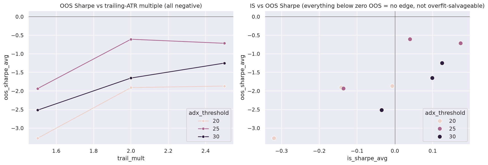

# Optimization Report: btc_prop_strategy_v2

**Date:** 2026-07-23
**Mode:** grid + walk-forward (5 expanding windows, ~25% OOS)
**Parameters Optimized:** adx_threshold [20,25,30] x rsi_oversold [5,10,15] x trail_mult [1.5,2.0,2.5]
**Total Configurations Tested:** 27 (each x 5 IS/OOS windows + full-history run = 297 backtests)

**Scope caveat (read first):** this optimizes the *buildable subset* only — daily bars instead of spec'd 4H/1H, Funding Farmer stubbed (no funding data), confluence scorer running technical+regime layers only (macro/on-chain/derivatives data unsourced). Results judge the degraded implementation, not the full DISCOVERY.md design. See PLAN.md deviations.

---

## Results Summary

### Baseline (config.yaml defaults, full history 2018-2026)

| Metric | Value |
|--------|-------|
| Sharpe | 0.006 |
| Total Return | -0.24% |
| Max DD | -6.46% |
| Win Rate | 29.9% |
| Trades | 127 (TR 114 / RH 10 / DCB 3) |
| Profit Factor | 1.01 |
| Prop-firm halt | never triggered |

Per sub-strategy: Trend Rider +$2,309 net (only profitable leg), Range Hunter -$1,394, DCB -$761 (0/3 trades won).

### Best Configuration Found (by OOS Sharpe)

| Parameter | Baseline | "Best" | Note |
|-----------|----------|--------|------|
| adx_threshold | 25 | 25 | unchanged |
| rsi_oversold | 10 | any | **zero effect** — volume gate suppresses Range Hunter almost entirely at adx≥25, all rsi values produce identical results |
| trail_mult | 2.0 | 2.0 | unchanged |

| Metric | IS avg | OOS avg |
|--------|--------|---------|
| Sharpe (best config) | +0.040 | **-0.608** |
| Sharpe (best full-history config, trail=2.5) | +0.174 | -0.717 |

**No configuration produced positive out-of-sample Sharpe. All 27 failed.** Range: OOS -0.608 (best) to -3.273 (worst).

---

## Overfitting Assessment

| Check | Status | Details |
|-------|--------|---------|
| IS vs OOS | **FAIL** | Every config: IS ≈ 0, OOS strongly negative. This is not overfitting (nothing to overfit — IS barely positive); it's absence of edge in the OOS period (2024-2026 slice) |
| Param Stability | **FAIL** | rsi_oversold has literally zero effect (identical outputs across all values) — dead parameter in this implementation |
| Trade Count | **FAIL** | OOS trades 20-23 per config, below the 30 minimum for significance |
| Monte Carlo | not run | pointless with no positive-expectancy config to bootstrap |

**Overall Risk: N/A — nothing worth adopting.** The danger here isn't overfitting, it's shipping a strategy with no demonstrated edge.

---

## Recommendation

**Do not adopt any optimized parameters. Do not proceed toward live/paper on this implementation.**

Interpretation, in order of importance:

1. **The buildable subset has no edge on daily bars.** The full-history result is breakeven before any 2024-2026 OOS slice, where it's clearly negative. This matches RESEARCH.md's warning that the source docs' win-rate claims (71-93%) were unvalidated practitioner estimates — first real backtest confirms they don't reproduce, at least not in this degraded form.
2. **Three specific causes are identifiable and fixable before declaring the whole design dead:**
   - **Wrong timeframes:** Trend Rider spec'd 4H entries, Range Hunter 1H — daily bars cut signal frequency ~4-24x and change signal character entirely. FMP has intraday endpoints (limited history); sourcing 4H/1H data is the single highest-value next step.
   - **Missing data layers:** Funding Farmer (the highest-claimed-win-rate leg) never traded; macro gate and on-chain confluence never filtered anything. The design's whole premise is multi-layer gating — this test ran essentially ungated.
   - **Range Hunter's volume gate** (added per EDA to tame RSI(2) noise) suppressed it to 10 trades in 8.5 years — overcorrected. Needs recalibration once intraday data exists.
3. **Prop-firm risk framework worked:** internal buffers never breached across 297 backtests, sizing behaved as designed. The risk layer is validated even though the signal layer is not.
4. **Kill-criteria status (DISCOVERY.md):** "Backtest Sharpe < 1.0 after full iteration cycle" — not yet triggered because this wasn't the full design, but formally on notice. If a future run with proper 4H/1H data + funding layer still can't clear Sharpe 1.0, kill per the strategy's own criteria.

### Next steps (priority order)
1. Source 4H (and ideally 1H) BTC OHLCV — check FMP intraday history depth first.
2. Re-run baseline + this same grid on intraday data.
3. Solve funding-rate data (Hyperliquid blocked here; Binance/Bybit funding history endpoints worth testing through the proxy).
4. Only then revisit optimization.

---

*Generated by CBT Framework /cbt:optimize*
