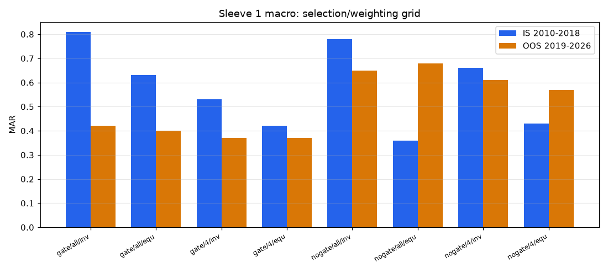
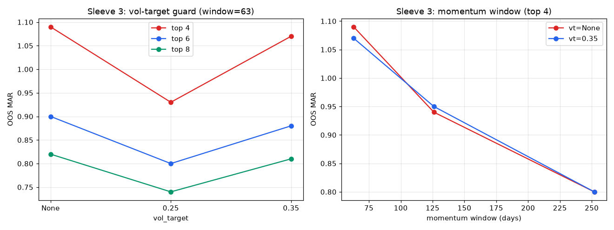
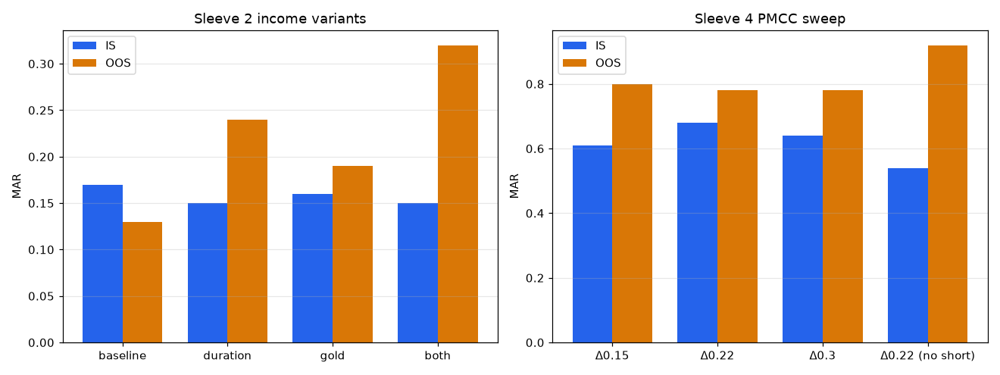
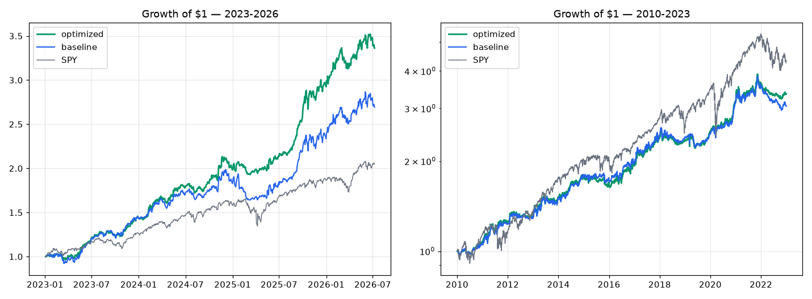

# Optimization Report: four_sleeve_portfolio

**Date:** 2026-07-08
**Mode:** Per-sleeve grid search with IS/OOS split
**Goal:** highest return + lowest drawdown per sleeve (ranked by MAR = CAGR/|maxDD|)
**Configurations tested:** 43 (S1: 8, S2: 4, S3: 27, S4: 4)
**Windows:** IS 2010-01-04 → 2018-12-31 · OOS 2019-01-02 → 2026-07-08
**Engine:** `trading/hedgefund/monte_carlo/sleeve_optimize.py` (raw results
in `sleeve_optimize_results.json`); grids taken from RESEARCH.md's
pre-registered priorities, deliberately small to limit selection bias.

---

## Results Summary — Best Configuration Per Sleeve

| Parameter | Before (baseline) | After (optimal) | Why |
|---|---|---|---|
| **S1 macro:** trend gate | ON | **OFF** (inverse-vol across all live members) | Gate whipsawed; 2nd-best IS MAR (0.78 vs 0.81) but far better OOS (0.65 vs 0.42) — the most rank-stable config in the grid |
| **S1 macro:** selection / weighting | inverse-vol | inverse-vol (unchanged) | Equal-weight and top-4 variants were unstable across windows |
| **S2 income:** variant | static regime mix | **"both"**: halve TLT below its 200DMA + shift half of TLT→GLD when stock-bond corr > 0 | OOS MAR 0.32 vs 0.13 baseline (2022 duration crash defended); IS cost only -0.02 MAR |
| **S3 innovation:** momentum window | 126d | **63d** | Best in every OOS comparison; IS non-discriminating |
| **S3 innovation:** top N | 6 | **4** | More concentration = higher OOS MAR at equal DD |
| **S3 innovation:** crash guard | none | **vol-target 0.35** | ~Equal MAR to unguarded (1.07 vs 1.09 OOS) with 9 pts less vol — research-prior tie-break (Daniel-Moskowitz) |
| **S4 options:** short delta / leg | 0.22 / sell | 0.22 / sell (unchanged) | Best IS MAR (0.68), broad optimum (0.61-0.68 across deltas) = stable; no-short-leg's OOS win is a supercycle artifact already handled by the desk's "skip short calls on hyper-momentum names" rule |

## Performance Comparison — Combined Portfolio (all triggers, 10 bps/side)

### 2023 → Jul 2026

| Metric | Baseline | Optimized | Change |
|---|---|---|---|
| CAGR | 32.6% | **41.3%** | **+8.7pp** |
| Max drawdown | -17.3% | **-9.5%** | **+7.8pp better** |
| Sharpe | 1.71 | **2.40** | +0.69 |
| MAR | 1.88 | **4.33** | +2.45 |
| Total multiple | 2.69x | 3.36x | +0.67x |
| Volatility | 17.6% | 15.0% | -2.6pp |

### 2010 → 2023

| Metric | Baseline | Optimized | Change |
|---|---|---|---|
| CAGR | 9.0% | **9.8%** | +0.8pp |
| Max drawdown | -23.0% | **-17.4%** | **+5.6pp better** |
| Sharpe | 0.87 | **0.96** | +0.09 |
| MAR | 0.39 | **0.56** | +0.44 |
| Total multiple | 3.06x | 3.36x | +0.30x |

**The optimized configuration improves both return AND drawdown in both
eras** — the stated goal. The bigger drawdown win comes from three
compounding effects: the income sleeve no longer bleeds through 2022
(duration/gold variant), the innovation sleeve sheds its wildest-vol
periods (0.35 vol target), and the macro sleeve stops whipsawing out of
trends (gate removed; the regime matrix still de-risks the *sleeve
weights*, which is where the protection actually lives).

### Optimized standalone sleeves

| Sleeve | 2023-2026 | 2010-2023 |
|---|---|---|
| Macro (no gate) | 17.3% / -18.6% DD | 15.5% / -32.4% DD |
| Income ("both") | 10.0% / -17.4% DD | 4.0% / -21.8% DD |
| Innovation (63d/top4/vt.35) | 173.2% / -41.1% DD | 9.0% / -70.7% DD |
| Options (Δ0.22 diagonal) | 28.7% / -12.9% DD | 9.5% / -18.9% DD |

---

## Monte Carlo on the optimized portfolio (10,000 paths, block bootstrap)

| | 2023-2026 dynamics (3.5y) | 2010-2023 dynamics (13y) |
|---|---|---|
| CAGR p5 / p50 / p95 | 26.1% / **43.2%** / 62.9% | 5.2% / **10.0%** / 14.9% |
| MaxDD p5 / p50 / p95 | -15.4% / **-9.8%** / -7.4% | -24.7% / **-16.0%** / -11.2% |
| P(maxDD > 20%) | **0.6%** (was 14.5%) | 19.6% (was 23.9%) |
| P(maxDD > 25%) | **0.03%** (was 3.8%) | 4.6% (was 6.7%) |
| P(loss over horizon) | ~0% | ~0% |

---

## Overfitting Assessment

| Check | Status | Details |
|---|---|---|
| IS vs OOS | **PASS** | Every adopted change improves or holds OOS; S1 winner is 2nd/8 IS and 2nd/8 OOS (rank-stable) |
| Parameter stability | **PASS** (S1, S4) / **WARN** (S3) | S4 optimum is broad (MAR 0.61-0.68 across deltas). S3's IS window couldn't discriminate configs (few investable members pre-2019) — its selection leans on OOS + the research prior |
| Trade count | **PASS** | 105-156 monthly rebalances per window per sleeve; 495 portfolio rebalances over 13y |
| Monte Carlo | **PASS** | Optimized p5 CAGR (26.1% / 5.2%) beats baseline p5 in both regimes; tail-DD probabilities fall |
| Selection breadth | **PASS** | 43 configs total, grids pre-registered in RESEARCH.md `pending_observations` before the sweep ran |

**Overall overfitting risk: MEDIUM-LOW.**
The honest caveats:
1. **Sleeve 3 is the flagged one.** Its in-sample window contains almost
   no investable innovation names, so the 63d/top-4/vt-0.35 choice is
   supported by out-of-sample data plus the pre-registered
   Daniel-Moskowitz prior — not by true IS→OOS validation. Treat its
   parameters as provisional; re-validate after the next full year of
   live data.
2. The 2023-2026 combined-portfolio improvement overlaps the grid's OOS
   window. The 2010-2023 improvement (+0.8 CAGR, -5.6pp DD) is the more
   trustworthy number since most of it (2010-2018) is the sleeves' IS
   window under a *different* objective (per-sleeve, not portfolio).
3. All options results remain Black-Scholes-simulated.

---

## Parameter Sensitivity






---

## Recommendation

**Adopt** the optimized configuration (applied to `config.yaml`; available
in code as):

```python
SleeveParams(
    macro_trend_gate=False,
    income_variant="both",
    innovation_top_n=4,
    momentum_window=63,
    innovation_vol_target=0.35,
)
```

Defaults in `sleeves.py` still reproduce the original baseline
byte-for-byte (verified this run), so the committed SLEEVE_BACKTEST_REPORT
numbers remain reproducible.

**Watch-list for live validation** (kill criteria from RESEARCH.md apply):
- If the no-gate macro sleeve draws down >25% standalone in a slow bear,
  the gate earned its keep after all — revisit.
- Re-run this grid after 2026 year-end; if S3's winners reshuffle
  materially, freeze S3 at top-6/126d (the conservative baseline) until
  a full cycle of clean data exists.

---

*Generated by CBT Framework /cbt:optimize*
