# Exploratory Data Analysis: hermes_agent

**Date:** 2026-08-26
**Data Range:** Price panel 2024-07-23 → 2026-08-24 (524 rows); ML features 2025-05-08 → 2026-08-24 (325 rows — starts ~9.5 months later)
**Project Type:** hybrid (indicator/OHLCV + ML)

> No RESEARCH.md exists yet for hermes_agent — this EDA runs directly on
> DISCOVERY.md's stated data (per the user's `/cbt:eda` invocation), not
> research-informed hypotheses. Treat it as a first look, not a
> confirmatory analysis. Re-run after `/cbt:research` narrows what to
> investigate.

> **Scope note:** the real-account holdings in `Data/real_accounts/` are
> point-in-time snapshots, not time series — nothing to run returns/
> volatility/seasonality analysis on until historical price data is
> fetched for those ~60+ uncached tickers (see DISCOVERY.md's data gap).
> This EDA covers what's actually replayable today: the BTC/ETH/SOL/
> spot-ETF/SPY/TLT daily panel and the BTC ML feature set.

---

## Data Overview

| Metric | Price panel (`btc_historical_data.csv`) | ML features (`btc_ml_features.csv`) |
|---|---|---|
| Rows | 524 | 325 |
| Columns | 11 (BTC-USD, IBIT, FBTC, ARKB, BITB, ETHA, MSTR, ETH-USD, SOL-USD, SPY, TLT) | 42 features + `target` |
| Date Range | 2024-07-23 → 2026-08-24 | 2025-05-08 → 2026-08-24 |
| Missing Values | 0 (0.000%) | 0 |
| Duplicate Timestamps | 0 | 0 |
| Calendar gaps >3 days | 13 (all ~4-day gaps, consistent with equity-market weekends/holidays merged into a panel that also includes 7-day-trading crypto — expected, not a data defect) | not separately checked (subset of same calendar) |

**The ML feature set's window is a strict subset of the price panel's** —
it starts 9.5 months later. Any model trained on `btc_ml_features.csv`
alone has ~40% less history than the raw price data would allow; worth
regenerating features back to 2024-07-23 if the feature-engineering
pipeline supports it.

---

## Key Findings

### 1. Distribution Characteristics (BTC-USD daily returns)
- Mean: +0.076%/day, Std: 2.89%/day
- **Skewness: 0.291** (mild positive skew — large up-moves slightly more
  extreme than large down-moves over this window)
- **Kurtosis: 3.988** (fat tails vs. Normal's 0 — large moves are far more
  frequent than a Gaussian model would predict, standard for crypto)
- **Stationarity:** price level is non-stationary (ADF p=0.478, expected —
  prices trend), but **returns are stationary** (ADF p<0.0001; KPSS
  p=0.10, fails to reject stationarity). Confirms the obvious-but-worth-
  checking point: any mechanical model here needs to work on returns/
  features, not raw price levels.

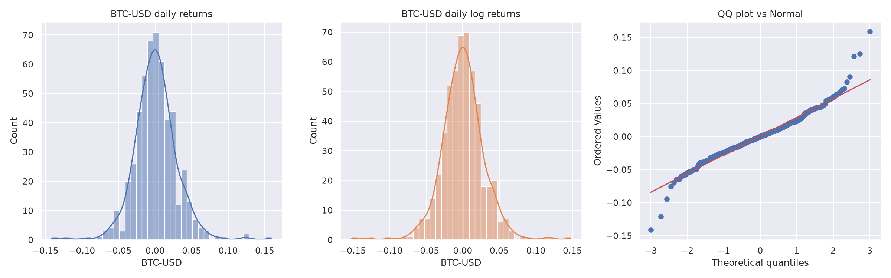
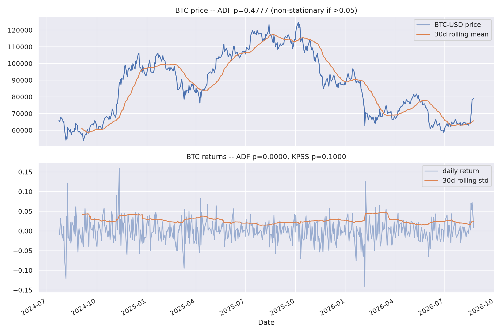

### 2. Correlation Structure
Return correlation with BTC-USD, price panel:

| Asset | Corr with BTC | Read |
|---|---|---|
| BITB / IBIT / FBTC / ARKB | 0.91 | Spot BTC ETFs — near-tautological, they hold BTC |
| ETH-USD | 0.84 | High crypto-beta co-movement |
| SOL-USD | 0.80 | Same |
| ETHA (spot ETH ETF) | 0.76 | |
| MSTR | 0.73 | BTC-proxy equity, as expected |
| SPY | 0.43 | Meaningful equity-market beta — BTC is not diversifying against broad equities in this window |
| TLT | -0.05 | Essentially uncorrelated — weak/no diversification value from duration here |

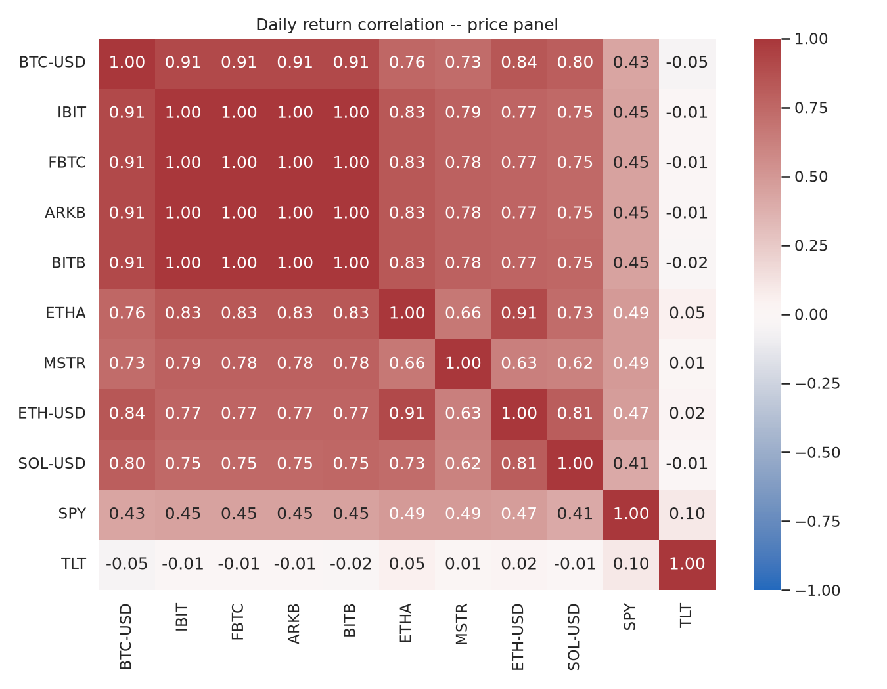

**Implication for the four candidate exit/entry designs in DISCOVERY.md:**
with SPY correlation at 0.43, a regime label built purely from equity-
market macro signals (VIX, SPY trend) will have real but limited
explanatory power over BTC-specific moves — consistent with treating
crypto flow/perps data as a *separate* input, not a proxy for macro
regime.

### 3. Volume Insights
**Not available in the price panel** — `btc_historical_data.csv` is
close-only across 11 tickers, no volume column. `btc_ml_features.csv` has
proxy volume columns (`btc_volume`, `mstr_volume`, `total_volume`) but
these turned out to be near-perfectly collinear with price and with each
other (see Collinearity below) — they don't carry independent
information as currently engineered.

### 4. Seasonality
Day-of-week and month-of-year mean BTC returns show no pattern large
enough to be worth acting on at n=524 — this is a weak/exploratory look,
not a statistical test of significance. Don't build a calendar effect
into hermes_agent on this evidence alone; if seasonality matters, cite
the existing `cycles.py` 4-year/16.8-year framework already validated
elsewhere in this repo rather than re-deriving it from 2 years of daily
BTC data.

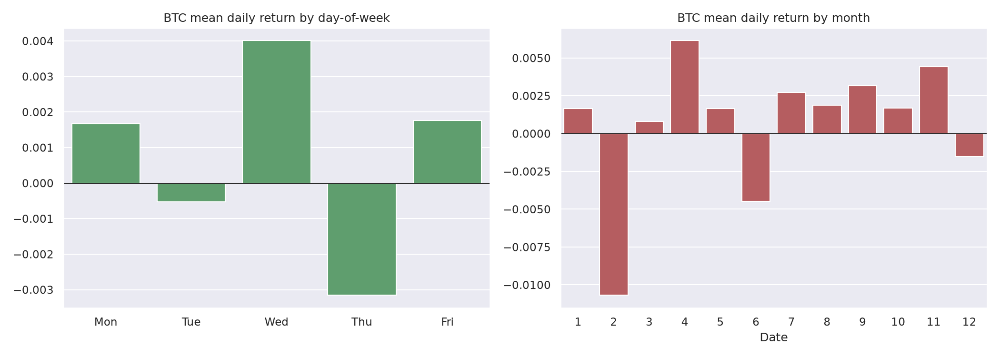

### 5. Volatility Regimes
30-day annualized volatility clusters as expected for crypto — 68 of 494
days (13.8%) sit above 1.5x the median 30-day vol. Visually, high-vol
clusters correspond to the known 2025 drawdown periods. This supports
the DISCOVERY.md candidate mechanism of **regime-conditional exposure
scaling** — there is real, persistent vol clustering to condition on, not
noise.

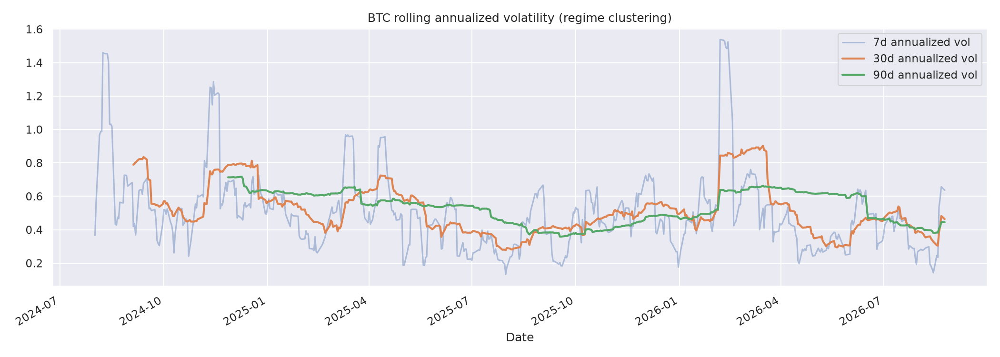

### 6. Feature Quality Assessment (ML)

**Target balance:** 52% / 48% (0/1) — no class-imbalance problem, a
model here fails or succeeds on signal quality, not resampling.

**Feature-target correlation is uniformly weak.** The strongest of all 42
features is `spy_return` at **|r| = 0.132**; everything else is smaller.
This is the single most important finding in this EDA, and it **directly
corroborates the 0.48-directional-accuracy caveat already flagged in
IDEA.md/DISCOVERY.md** — none of these engineered features has a linear
relationship with next-period direction strong enough to build a
reliable classifier on its own. (A weak linear correlation doesn't rule
out non-linear or interaction effects a tree-based model might find, but
it's a real yellow flag, not a reason for optimism.)

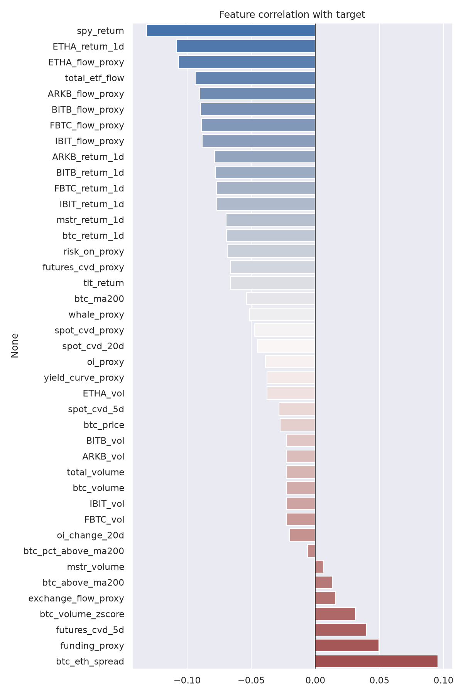

**Severe collinearity.** 80 of the 42-choose-2 = 861 feature pairs have
|corr| > 0.9, and many are **exactly 1.0** —
`IBIT_return_1d == FBTC_return_1d == ARKB_return_1d == BITB_return_1d`
and similar sets for the `_vol` and `_flow_proxy` columns. In practice,
the "42 features" reduce to a much smaller set of independent signals:
the four spot-BTC-ETF return/flow/vol groups are redundant duplicates of
each other (and of `btc_volume`/`oi_proxy`), not four independent votes.
Any linear model here needs real feature selection or regularization
before use; a tree-based model is more robust to this but interpretability
suffers when four identical columns compete for the same split.

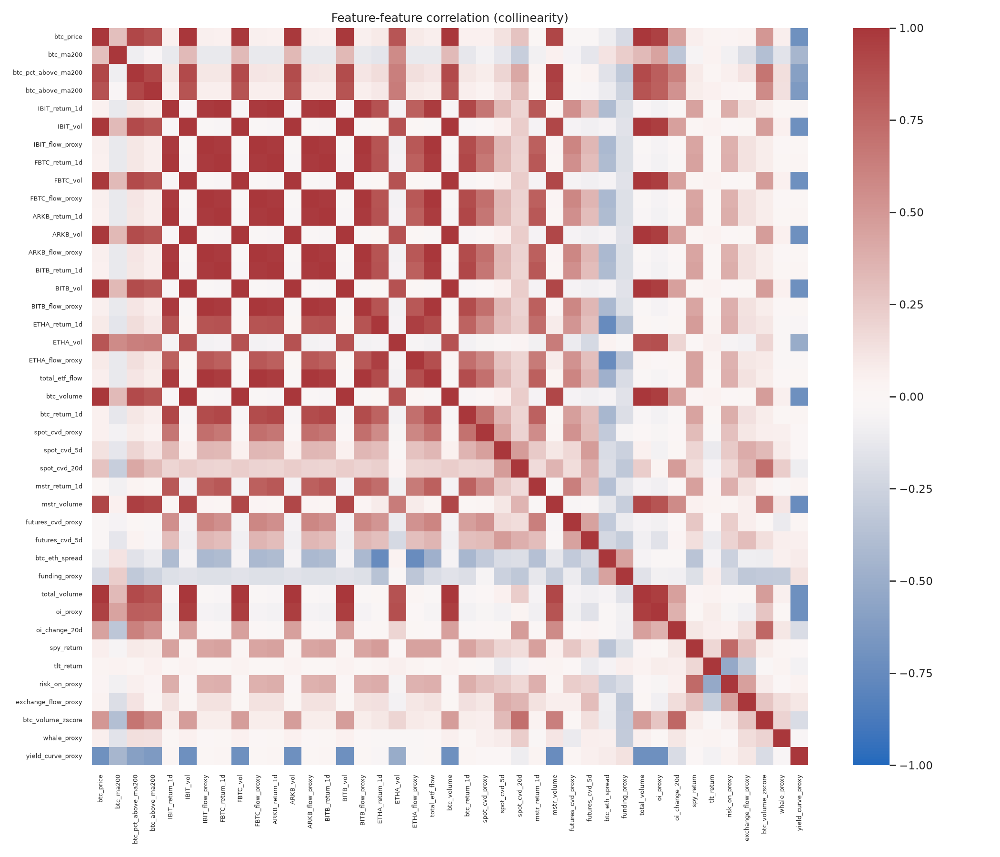

**Train/test distribution drift.** Splitting chronologically (first 70% /
last 30%), **22 of 42 features show a statistically significant
distribution shift** (KS test, p<0.01), several with very large KS
statistics (0.80-0.92) — `btc_volume`, `oi_proxy`, `yield_curve_proxy`,
and all four ETF `_vol` columns among the worst. This means a model fit
on the early period will see meaningfully different feature distributions
in the later period — a real risk for any walk-forward validation in
`/cbt:research`, and independent confirmation of why the live bus's own
BTC ML ensemble backtested near coin-flip: the features it's built on
are not stable across regimes.

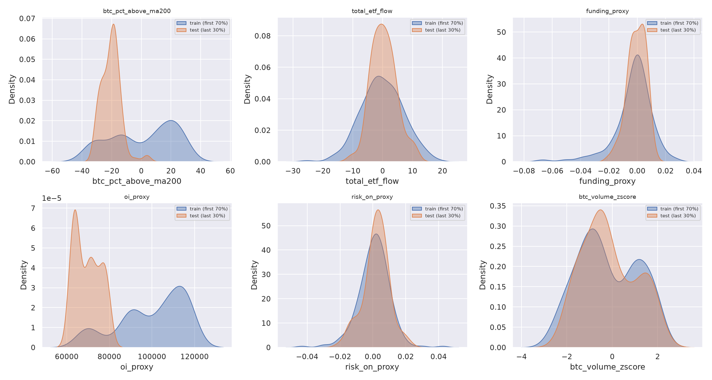

Missing values: zero across both datasets — not a data-quality issue.

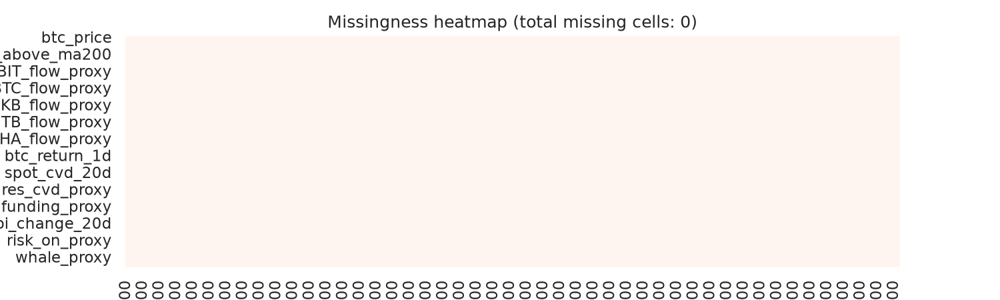
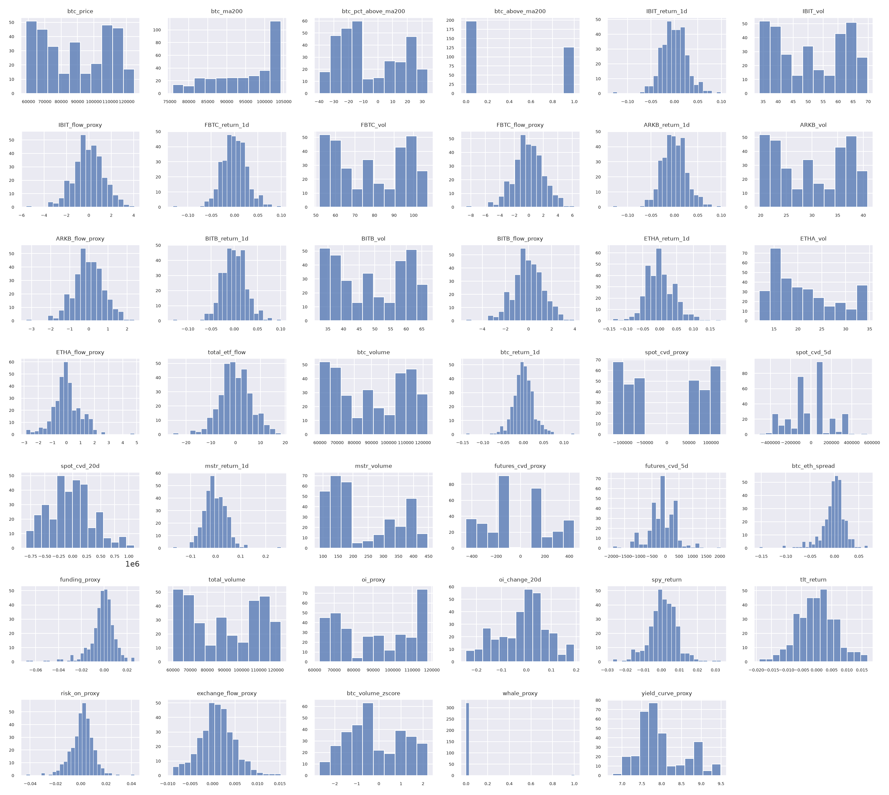
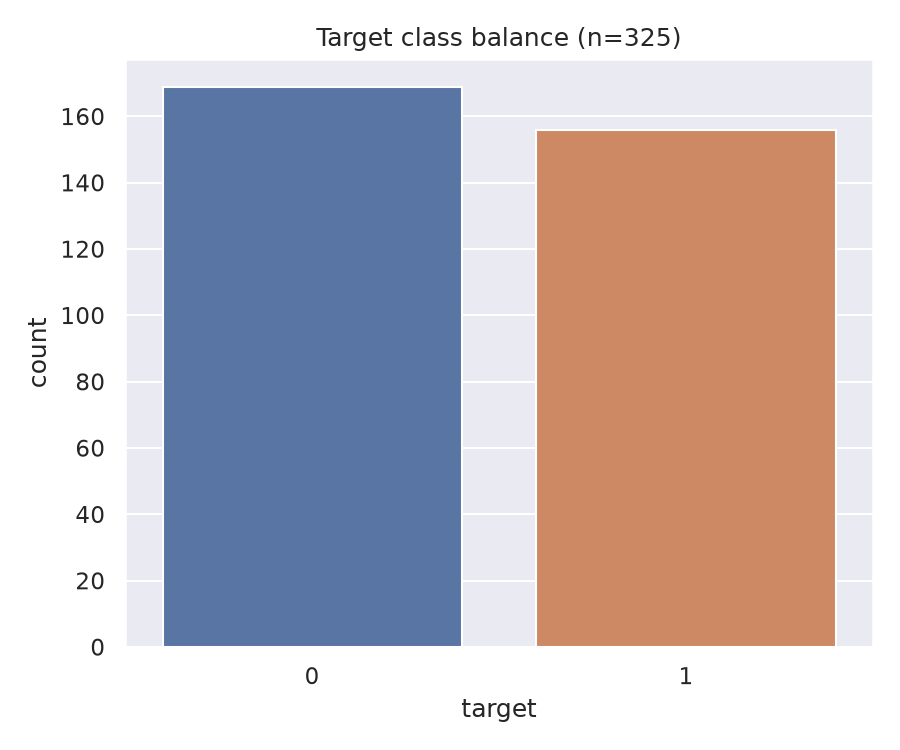

---

## Implications for Strategy

### Supports Hypothesis
- Real, persistent volatility clustering exists → supports the
  **regime-conditional exposure scaling** candidate mechanism from
  DISCOVERY.md (mechanism #2), which is also the one this repo's
  four-sleeve system already validated elsewhere.
- Fat tails / positive skew in BTC returns are consistent with a
  trend-following, asymmetric-payoff design (large-winner-small-loser),
  which fits the regime-scaled trailing stop the user chose for exits.

### Challenges to Hypothesis
- **Feature-target correlation this weak (max |r|=0.13) is a genuine
  warning sign for the ML component**, not just a caveat to note and move
  past. Combined with the bus's own reported 0.48 backtest accuracy, the
  honest read is: this feature set, as currently engineered, does not
  obviously contain a tradeable directional edge. The "no strong prior —
  test empirically" framing from discovery was the right call.
- Heavy collinearity means the 42-feature set is really ~10-15
  independent signals wearing 42 names — research should deduplicate
  before any model-fitting, or risk mistaking redundancy for confirmation.
- Train/test drift on over half the features means a single-window
  backtest will overstate confidence — walk-forward with the drift-flagged
  features watched closely is not optional here.

### Suggested Adjustments
1. **Deduplicate the feature set before /cbt:research**: collapse the
   four near-identical ETF return/flow/vol groups into one representative
   column each (or a PCA/mean composite), rather than feeding 42 columns
   with ~10-15 degrees of freedom into a model.
2. **Extend the feature window back to 2024-07-23** to match the price
   panel, if the feature-generation code allows — more history helps
   both the drift analysis and any walk-forward split.
3. **Treat the BTC ML ensemble as a candidate to drop, not a component to
   keep by default** — per DISCOVERY.md's open question #3, this EDA adds
   evidence (not proof) that it should be dropped or heavily de-weighted
   unless research finds a non-linear signal a raw correlation misses.
4. **Lean on regime/volatility conditioning over point-prediction** — the
   data supports vol clustering more than it supports directional
   features, matching mechanism #2 over #1/#3 from DISCOVERY.md's edge
   candidates.

---

## Plots Generated

| Plot | File |
|------|------|
| Returns Distribution | `plots/eda/returns_distribution.png` |
| Correlation Matrix | `plots/eda/correlation_matrix.png` |
| Seasonality | `plots/eda/seasonality.png` |
| Volatility Regimes | `plots/eda/volatility_regimes.png` |
| Stationarity | `plots/eda/stationarity.png` |
| Feature Distributions | `plots/eda/feature_distributions.png` |
| Target Analysis | `plots/eda/target_analysis.png` |
| Feature-Target Correlations | `plots/eda/feature_target_correlations.png` |
| Collinearity | `plots/eda/collinearity.png` |
| Missing Values | `plots/eda/missing_values.png` |
| Train/Test Comparison | `plots/eda/train_test_comparison.png` |

Volume profile was skipped — no volume data exists in the price panel
(see "Volume Insights" above).

Raw summary statistics: `plots/eda/eda_summary.json`
Reproduce: `python3 eda_analysis.py` from `strategies/hermes_agent/`

---

*Generated by CBT Framework /cbt:eda*
